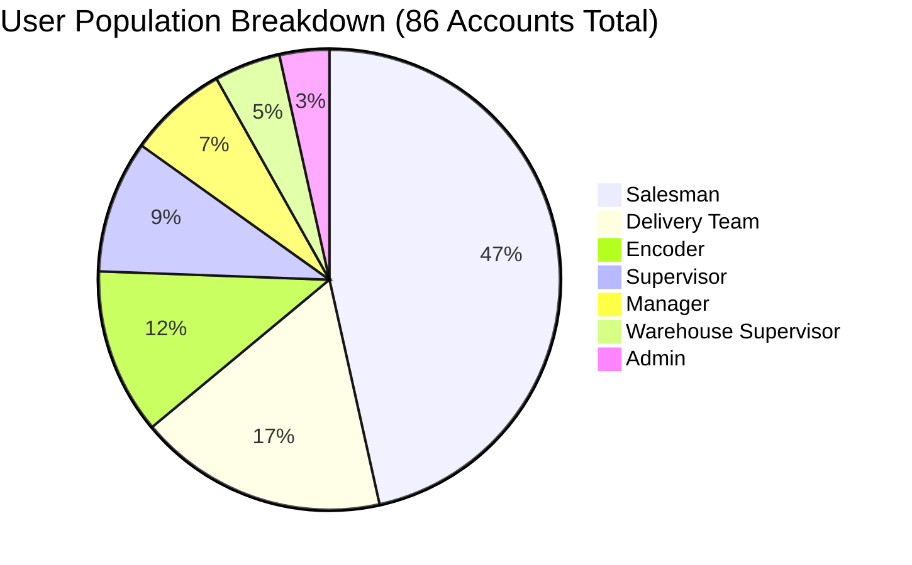
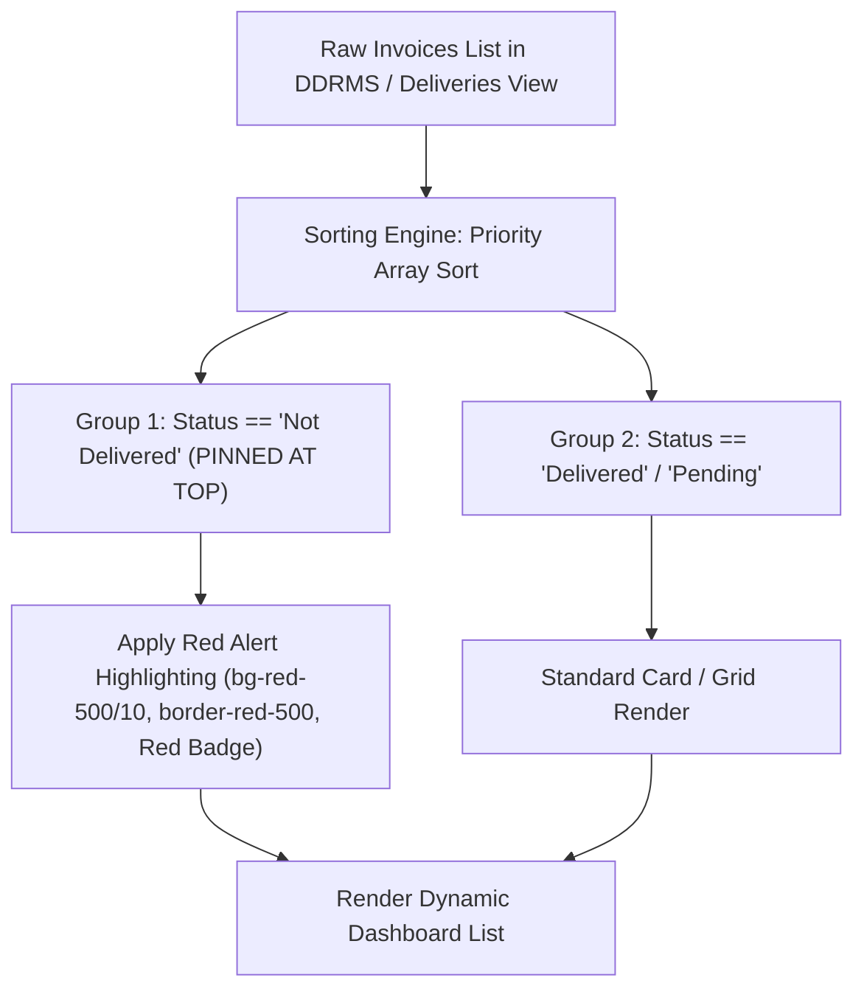
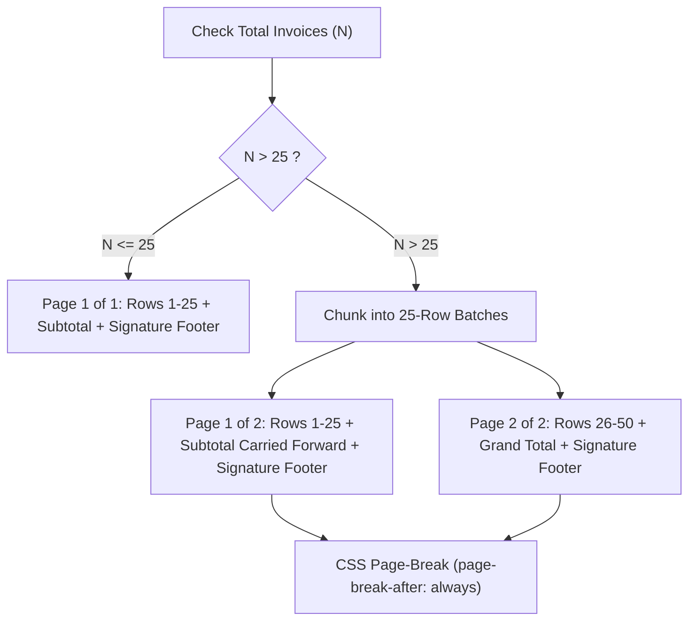

# 🚚 Logistics and Delivery System - Architectural Master Plan & Implementation Specification

> **IMPORTANT DIRECTIVE FOR AI DEVELOPMENT AGENTS (CLAUDE OPUS / GEMINI 3.1 PRO / GPT-5)**:  
> You MUST read this specification file ([`LOGISTICS_AND_DELIVERY_PLAN.md`](file:///c:/Users/User/Desktop/Mini%20Projects/sales%20monitoring/LOGISTICS_AND_DELIVERY_PLAN.md)) and the visual implementation plan artifact ([`logistics_delivery_implementation_plan.md`](file:///C:/Users/User/.gemini/antigravity-ide/brain/a3ec8982-f36b-45fd-af96-b0ebbc7c5ee9/logistics_delivery_implementation_plan.md)) thoroughly before writing any code.  
> You are empowered and instructed to adhere strictly to all quantitative layouts (80%/20%), role permission matrices, paper print dimensions (8.5in x 13in Folio), local-first IndexedDB caching rules, and Firestore read/write calculations. You are also encouraged to propose and implement versatile, high-value optimizations (e.g., barcode/QR scanner readiness, offline sync progress banners, and automated Excel formula verification) as you build out each phase.

---

## 📐 1. System Goals & Core Architectural Principles

### 🎯 Primary Goals
1. **Logistics & Delivery Suite Expansion**: Introduce a new top-level menu group **"Logistics and Delivery"** featuring 5 operational pages:
   - 🚐 **Logistics Manning** (`/logistics/manning`)
   - 📅 **Delivery Schedule** (`/logistics/schedule`)
   - 📦 **Deliveries** (`/logistics/deliveries`)
   - 📋 **Picklist** (`/logistics/picklist`)
   - 🧾 **DDRMS** (`/logistics/ddrms`)
2. **Local-First Zero-Latency Data Pipeline**: All data entries, dynamic grid edits, and Excel clipboard pastes are persisted instantly to browser **IndexedDB** (`idb-keyval`). A red circle notification badge (`🔴 [Count]`) alerts users of unsynced drafts until final user confirmation and batch cloud upload.
3. **'Not Delivered' Highlighting & Top-Pinned Sorting**:
   - Invoices tagged as **`Not Delivered`** are visually highlighted with a **distinct red warning badge and background container glow (`rgba(239,68,68,0.12)`)**.
   - **Pinned Top Priority Ordering**: `Not Delivered` invoices are automatically sorted and pinned at the **very top of the list** across all views (Deliveries Mobile UI, DDRMS feeds, Manager/Supervisor/Admin monitoring dashboards) so teams can immediately spot and address unfulfilled shipments.
4. **Physical Booklet vs System Invoice Mapping**:
   - **1 System Invoice Number** = **1 Single Line Item Row in DDRMS** (represents 1 customer transaction).
   - **Invoice Number Column**: Displays the physical booklet page series range (e.g. `12345-368`).
   - **Comma Separation `,`**: Indicates multiple physical booklet series when a booklet runs out mid-transaction and a new booklet is used (e.g. `12345-399, 12400-409`).
5. **Picklist Assignment Uniqueness Rule**: A Picklist record can only be attached to **one active Delivery Schedule at a time** to prevent double-dispatching.
6. **Encoder Collection Creation Engine**: Encoders record payment remittance collections for completed DDRMS deliveries, specifying Cash, Check details (Bank Name, Check Number, Check Date, Amount), and DR numbers, updating DDRMS status to `Remitted`.
7. **Offline Conflict Resolution**: Field-level Last-Write-Wins (LWW) with explicit audit timestamps for rural low-connectivity delivery routes.
8. **DDRMS Official Print & Export Engine**:
   - Paper size: **8.5 in x 13 in (Folio / Long Bond Paper)** landscape.
   - Maximum **25 rows per page** with automatic pagination (>25 System Invoices generates Page 2, Page 3, etc.).
   - Contiguous cell merging for identical `Invoice Date` and `Picklist Number` cells.
   - Admin-configurable header titles (`companyName`, `divisionTitle`) and Cashier Full Name (`officerInChargeCashierName`).
   - Admin Date Range Multi-Sheet Excel export (one dedicated worksheet tab per DDRMS No.).

---

## 🏗️ 2. Technology Stack & Architectural Layers

```
+-----------------------------------------------------------------------------------+
|                                 FRONTEND LAYER                                    |
|  React 19 + TypeScript 5.x + Vite 8 + Vanilla CSS Glassmorphism                  |
|  React Router v7 (Navigation & Dynamic Role Guard HOCs)                           |
|  Lucide React (Icons) + Recharts (Visual Analytics)                               |
+-----------------------------------------------------------------------------------+
                                         │
                                         ▼
+-----------------------------------------------------------------------------------+
|                       DYNAMIC EDITING & LOCAL CACHE LAYER                         |
|                                                                                   |
|  ┌──────────────────────────────────┐      ┌──────────────────────────────────┐  |
|  │ DynamicDataGrid Engine           │      │ IndexedDB Local Store            │  |
|  │ - Clipboard API (onPaste parser) │ ───> │ - Powered by `idb-keyval` v6.2   │  |
|  │ - Booklet Range Formatter        │      │ - Local draft state persistence  │  |
|  │ - Multi-cell keyboard navigation │      │ - Pending upload badge counter   │  |
|  └──────────────────────────────────┘      └──────────────────────────────────┘  |
+-----------------------------------------------------------------------------------+
                                         │
                                         ▼ (User Action: "Confirm & Sync to Cloud")
+-----------------------------------------------------------------------------------+
|                         BACKEND & CLOUD STORAGE LAYER                             |
|  Firebase Firestore (NoSQL Document Store, writeBatch atomic commits)            |
|  Firebase Auth (Role-based authentication & plate-number accounts)                |
|  xlsx-js-style v1.2 (Multi-Sheet Formatted DDRMS Exports with Merged Cells)       |
+-----------------------------------------------------------------------------------+
```

---

## 👥 3. User Roles, User Population & Access Matrix

Total active user population: **86 Accounts**.



### Role Authorization Matrix

| Page / Feature | Admin (3) | Manager (6) | Supervisor (8) | Warehouse Sup (4) | Salesman (40) | Delivery Team (15) | Encoder (10) |
| :--- | :---: | :---: | :---: | :---: | :---: | :---: | :---: |
| **Logistics Manning** | Full Edit | Read Only | Read Only | Full Edit | No Access | No Access | No Access |
| **Delivery Schedule** | Full Edit + Export | Read Only | Read Only | Full Edit | No Access | No Access | Read Only |
| **Deliveries UI** | Full Edit + Override | Read Only | Team Read | Team Edit / Override | Assigned Read | **Delivery Confirm** | Created Read |
| **Picklist** | Full Edit + Export | Read Only | Read Only | Status & Checker Edit | No Access | No Access | **Full Edit** |
| **DDRMS** | Full Edit + Dual Export | Read Only | Read Only | Read Only | Assigned Read | No Access | **Full Edit** |
| **Collection Creation** | Full Edit | Read Only | Read Only | Read Only | No Access | No Access | **Full Edit** |
| **DDRMS Global Config** | **Full Edit** | Read Only | Read Only | Read Only | Read Only | Read Only | Read Only |

---

## 💻 4. Comprehensive TypeScript Schemas & Data Contracts

```typescript
// 1. Logistics Manning Schema
export interface LogisticsManning {
  id: string;
  plateNumber: string; // Account: [plateNumber]@KENEA.com
  driverName: string;
  helpers: string[];
  vehicleType: 'Elf' | 'Forward' | '10WH' | '6WH' | 'Tractor';
  createdAt: string;
  updatedAt: string;
}

// 2. Delivery Schedule Schema
export interface DeliverySchedule {
  id: string;
  date: string;
  plateNumber: string;
  picklistNumbers: string[];
  route: string;
  noOfAccounts: number;
  qtyCS: number;
  salesmen: string[];
  helpers: string[];
  remarks?: string;
  status: 'Scheduled' | 'In Transit' | 'Completed';
  createdBy: string;
}

// 3. Picklist Schema
export interface Picklist {
  id: string;
  picklistDate: string;
  picklistNumber: string;
  city: string;
  salesmanCode: string;
  salesmanName: string;
  cs: number;
  sc: number;
  pc: number;
  estimatedAmount: number;
  numberOfAccounts: number;
  systemStatus: 'Allocated' | 'Invoiced' | 'Scheduled' | 'Completed';
  assignedChecker?: string;
  encoderId: string;
  encoderName: string;
  createdAt: string;
}

// 4. DDRMS Invoice Line Item
export interface DDRMSInvoice {
  id: string;
  invoiceDate: string;
  picklistNumber: string;
  systemInvoiceNumber: string;
  invoiceNumberSeries: string; // Booklet series e.g. "12345-368, 12400-409"
  customerCode: string;
  customerName: string;
  barangay: string;
  city: string;
  province: string;
  grossAmount: number;
  cs: number;
  pc: number;
  sc: number;
  deliveryStatus: 'Pending' | 'Delivered' | 'Not Delivered';
  notDeliveredReason?: 'Store Closed' | 'Customer Refused' | 'Payment Issue' | 'Damaged/Missing Goods' | 'Out of Time';
  remarks?: string;
  updatedAt: string;
}

// 5. DDRMS Document Schema
export interface DDRMSHeader {
  id: string;
  ddrmsNumber: string;
  salesmanCode: string;
  salesmanName: string;
  plateNumber: string;
  deliveryDate: string;
  driverName: string;
  noOfHelpers: number;
  routeCity: string;
  encoderId: string;
  encoderName: string;
  companyName: string; // Admin configurable
  divisionTitle: string; // Admin configurable
  officerInChargeCashierName: string; // Admin configurable
  status: 'Submitted' | 'On The Way' | 'Delivered' | 'Remitted';
  invoices: DDRMSInvoice[];
  totalGrossAmount: number;
  totalCS: number;
  totalPC: number;
  totalSC: number;
  remittanceCash?: number;
  remittanceDR?: number;
  remittanceChecks?: number;
}
```

---

## 🚨 5. 'Not Delivered' Top-Pinned Priority & Visual Highlighting



---

## 🧾 6. DDRMS Template & Print Engine (8.5in x 13in Folio)

### 📄 1. Paper & Print Setup
- **Dimensions**: **8.5 in x 13 in (Folio / Long Bond Paper)** Landscape.
- **CSS Rule**: `@page { size: 8.5in 13in landscape; margin: 0.5in; }`.
- **Excel Setup**: `ws['!pageSetup'] = { paperSize: 14, orientation: 'landscape', fitToWidth: 1 }`.

---

### 📑 2. Automatic Multi-Page Pagination Rule (> 25 Invoices)



---

## 🧮 7. Comprehensive Firestore Read & Write Calculation

### 📊 Baseline Parameters (86 Active Users, 26 Days/Month)

| Operational Area | Daily Writes (Peak) | Daily Reads (Optimized) | Monthly Writes (26 Days) | Monthly Reads (26 Days) |
| :--- | :---: | :---: | :---: | :---: |
| **Picklist Management** | 300 | 2,200 | 7,800 | 57,200 |
| **Logistics Manning** | 20 | 250 | 520 | 6,500 |
| **Delivery Schedule** | 20 | 800 | 520 | 20,800 |
| **DDRMS Management** | 720 | 1,500 | 18,720 | 39,000 |
| **Delivery Confirmation** | 600 | 900 | 15,600 | 23,400 |
| **TOTAL LOAD** | **1,660 / day** | **5,650 / day** | **43,160 / month** | **146,900 / month** |

- **Firebase Firestore Daily Limits**: 20,000 writes/day & 50,000 reads/day.
- **Consumption Ratio**: Writes = **8.3%**, Reads = **11.3%**.
- **Financial Cost**: **$0.00 USD / Month (100% FREE TIER)** 🎉
